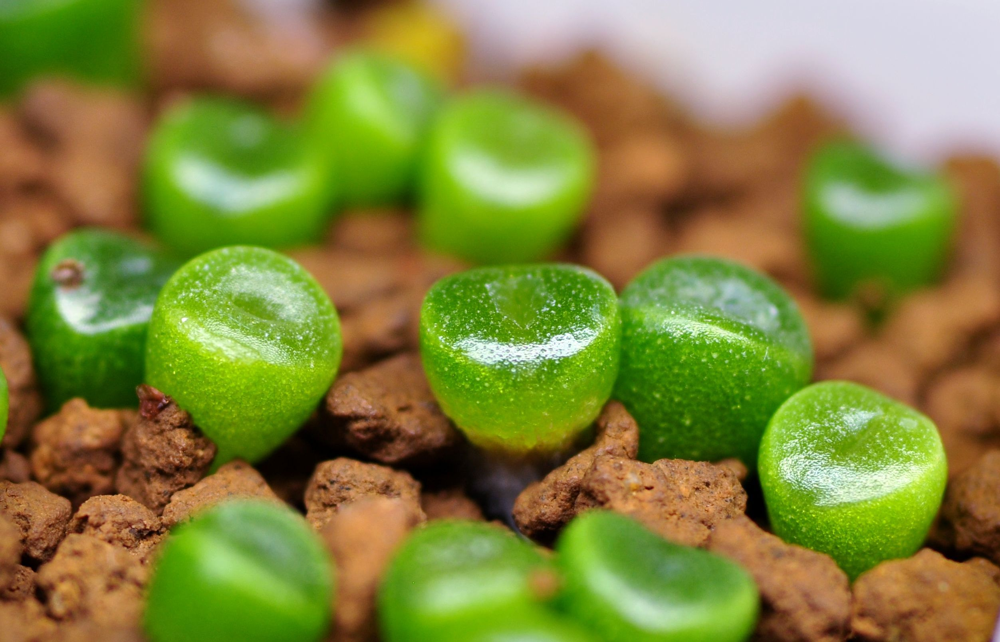

# Mesemb Marathon Project
[lithops.life](https://lithops.life)

## About the Repository

This repository contains the source code for the Mesemb Marathon project website ([lithops.life](https://lithops.life)), providing resources and information for our community.

## What is the Mesemb Marathon?

The Seed Sowing Marathon is a long-term event where participants sow seeds (mainly aizoaceae) on the same day and observe their growth for at least a year, fostering a shared community experience.

## Competitive Species

We select certain species as "competitive" requiring special attention. Participants submit photos of their seedlings at specified intervals for evaluation. Links to some of Competitive Tables:

- [Lithops werneri, C188](https://lithops.life/marathon/2023/c188)
- [Lithops gracilidelineata, C262](https://lithops.life/marathon/2023/c262)
- [Lithops hookeri var. dabneri cv. 'Annarosa'](https://lithops.life/marathon/2023/annarosa)

## Contacts

For inquiries, please visit our [Contact Page](https://lithops.life/marathon/contacts) or email us at [d.natxa@gmail.com](mailto:d.natxa@gmail.com).

